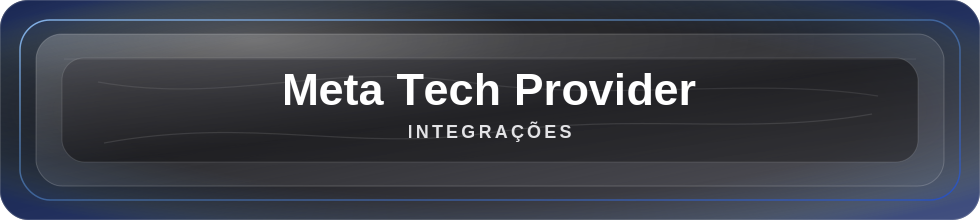

 
  
 
    
   
     

Sobre mim
Sou Matheus Pereira Bernardes, estudante de Sistemas de Informação e Founder/CTO do Grupo KAMI. Trabalho na interseção entre engenharia de software, automação corporativa, IA aplicada, observabilidade e infraestrutura segura.

Meu foco é construir sistemas que não dependem de improviso: processos rastreáveis, agentes com telemetria, integrações oficiais, automações duráveis e arquitetura orientada a ROI.

Arquiteturo fluxos críticos com Temporal, LangGraph, APIs, eventos e workers.
Opero stacks self-hosted com Docker, Kubernetes, NGINX, bancos de dados e LLMs locais.
Implemento observabilidade com Grafana, Prometheus, Loki, Tempo, OpenTelemetry e Langfuse.
Desenvolvo integrações oficiais no ecossistema Meta, incluindo WhatsApp Cloud API e Facebook Graph API.
Construo soluções com RAG, embeddings vetoriais, OCR, guardrails, avaliação e persistência de contexto.
Meta Tech Provider

  
 
    

Credencial	O que isso representa na prática
Meta Tech Provider	Capacidade de projetar, implementar e operar integrações nativas no ecossistema Meta, com foco em escala, rastreabilidade e conformidade técnica.
WhatsApp Cloud API	Mensageria oficial, templates, webhooks, fluxos conversacionais, automações de atendimento e integrações com sistemas internos.
Facebook Graph API	Integrações com ativos Meta, permissões, eventos, rotas seguras e automações conectadas ao ecossistema Facebook/Meta.
Operação confiável	Filas, retentativas, fallback, logs estruturados, auditoria, segregação de credenciais e rastreabilidade ponta a ponta.
Stack de produção
Camada	Stack
Orquestração durável	Temporal, workers Python/Node.js, filas, retries, idempotência e workflows auditáveis
Agentes e IA	LangGraph, RAG, FAISS, LLMs locais, guardrails, avaliação e memória contextual
Observabilidade	Grafana, Prometheus, Loki, Tempo, OpenTelemetry, Langfuse, SLOs, alertas e tracing
Integrações oficiais	WhatsApp Cloud API, Facebook Graph API, webhooks, REST APIs e autenticação JWT
Infraestrutura	Docker, Kubernetes, NGINX, Linux, CI/CD, hardening e monitoramento de servidores
Dados	PostgreSQL, MongoDB, Supabase, Redis, modelagem relacional e não relacional
Observabilidade como disciplina
Não trato observabilidade como dashboard bonito no fim do projeto. Ela entra na arquitetura desde o começo para responder três perguntas: o que aconteceu, por que aconteceu e quanto custou.

Grafana para dashboards operacionais, alertas, SLOs e leitura executiva.
Prometheus para métricas de serviços, workers, filas e infraestrutura.
Loki para logs estruturados com correlação por fluxo, cliente e operação.
Tempo para traces distribuídos entre API, worker, banco, agente e provedor externo.
OpenTelemetry para padronizar spans, métricas e contexto entre serviços.
Langfuse para tracing de LLMs, custo, latência, avaliação, prompts e comportamento de agentes.
Stack principal
<h3 align="center">Linguagens</h3> 
      
 <h3 align="center">Orquestração, agentes e IA</h3> 
       
 <h3 align="center">Observabilidade</h3> 
       
 <h3 align="center">Infraestrutura, dados e integrações</h3> 
         

Projetos e impactos
Frente	Resultado prático
Gestão de contratos	Workflows de vencimentos, renovações, alertas e escalonamentos para reduzir perdas por prazo
Cobrança com IA	Agentes com negociação contextual, follow-up contínuo e apoio à recuperação de caixa
Procurement automatizado	Cotações simultâneas, comparação algorítmica de preços e histórico consolidado de compras
Infra self-hosted	Servidores conteinerizados para agentes, bancos, observabilidade e LLMs locais com soberania de dados
Segurança aplicada	Mitigação de vulnerabilidades críticas, hardening, JWT e guardrails contra respostas inseguras
IA com RAG	Qualificação de leads, agendamento inteligente, contexto vetorial e cache de conhecimento
OCR + fullstack	Plataforma web com preenchimento automático de formulários via API
Como penso arquitetura

Cliente / Lead / Operação
APIs, Webhooks e Eventos
Temporal Workflows
Workers Python / Node.js
LangGraph Agent + RAG
Vector Store / FAISS
Guardrails / Avaliação
PostgreSQL / MongoDB /Supabase
WhatsApp Cloud API / MetaGraph API
OpenTelemetry
Grafana / Loki / Tempo /Prometheus
Langfuse Traces / Prompts /Evals
GitHub analytics

   
 
  

O que estou aprofundando agora
Workflows duráveis com Temporal, idempotência, retentativas e compensação.
Agentes stateful com LangGraph, memória, ferramentas, RAG e avaliação.
Observabilidade de LLMs com Langfuse: custo, latência, traces, prompts e qualidade.
Telemetria distribuída com OpenTelemetry, Grafana, Prometheus, Loki e Tempo.
Hardening de stacks self-hosted e desenho de APIs seguras para produção.
Princípios de trabalho
Inspirado nas leis da robótica de Isaac Asimov, trato automações, agentes e sistemas de IA como software que precisa respeitar uma hierarquia clara: não causar dano, obedecer a intenção humana legítima e preservar sua própria operação apenas quando isso não compromete os dois primeiros pontos.

Princípio	Como aplico em sistemas reais
Segurança antes de autonomia	Nenhum agente deve executar ações críticas sem limites, validação, auditoria e trilhas de decisão.
Controle humano explícito	A automação deve obedecer objetivos humanos definidos, com escopo claro, permissões mínimas e possibilidade de intervenção.
Resiliência sem teimosia	O sistema deve se recuperar, retentar e se proteger, mas nunca insistir em um fluxo inseguro, opaco ou fora da intenção original.
Observabilidade como obrigação	Se uma decisão não pode ser rastreada, medida e explicada, ela ainda não está pronta para produção.

 <strong>Segurança</strong> + <strong>Controle</strong> + <strong>Rastreabilidade</strong> + <strong>Resiliência</strong> + <strong>ROI</strong> 
 
